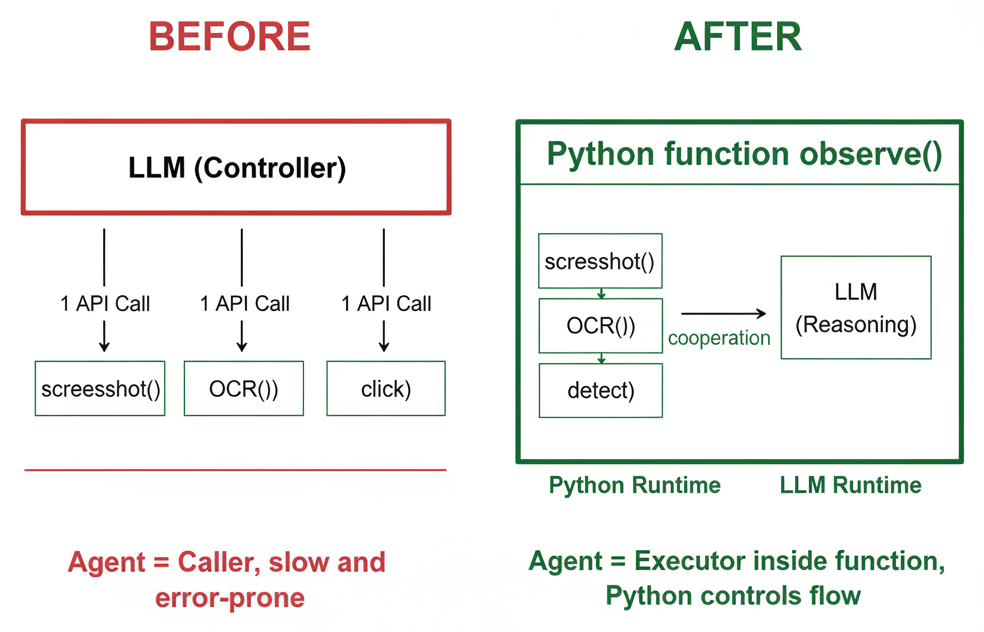
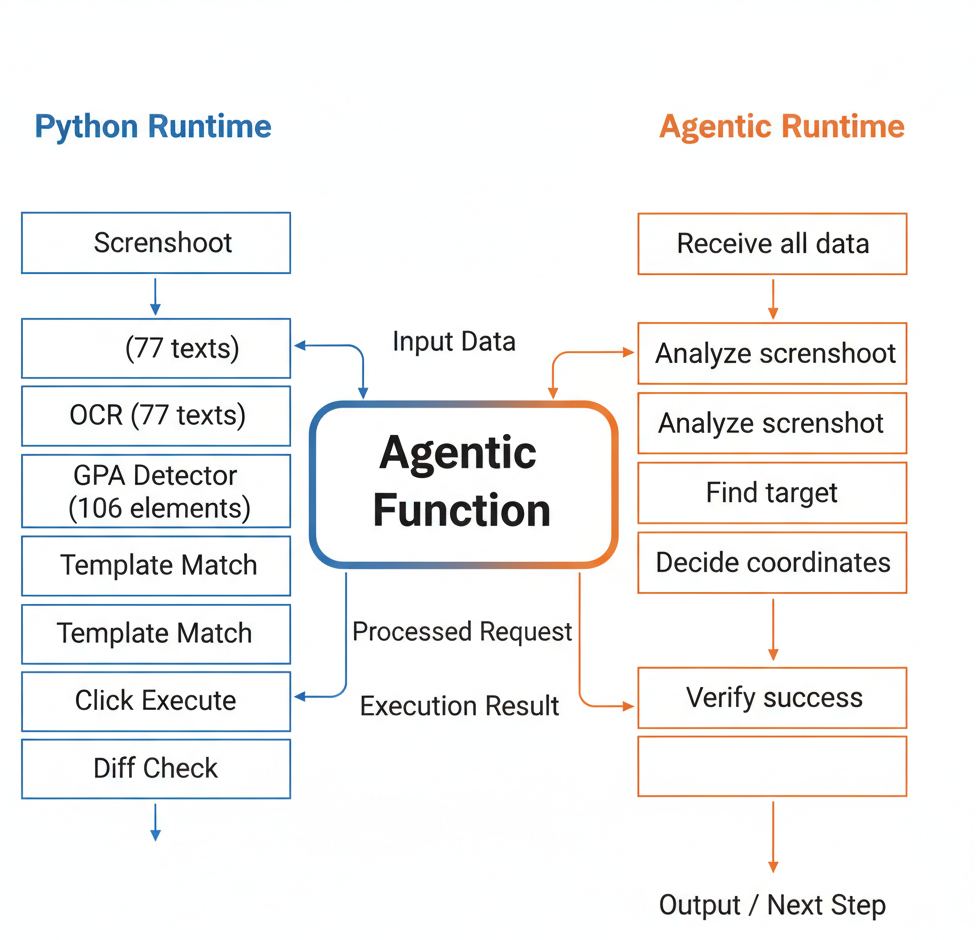
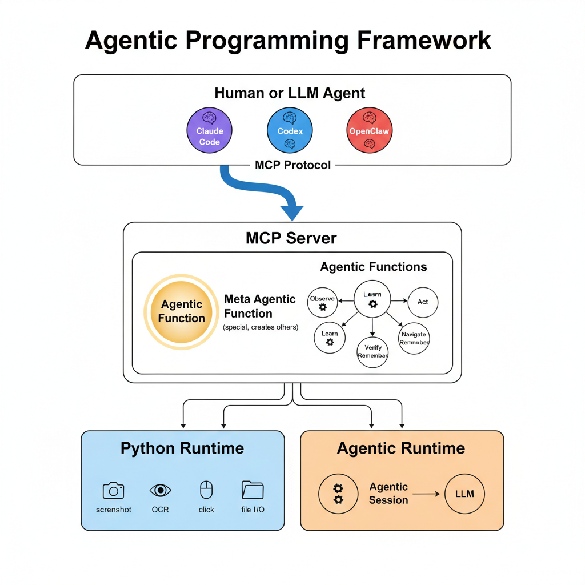
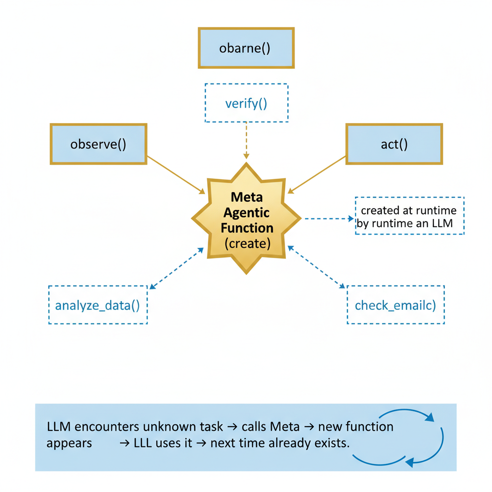

# Agentic Programming

> A programming paradigm where Python and LLM co-execute functions.



**Traditional approach**: LLM calls tools one by one (slow, fragile, context-heavy).  
**Agentic Programming**: Python functions bundle deterministic code + LLM reasoning together. The LLM works *inside* the function, not outside it.

---

## How It Works

Every Agentic Function has two runtimes cooperating:



```python
from agentic import agentic_function, runtime

@agentic_function
def observe(task):
    """Look at the screen and find all visible UI elements.
    Check if the target described in task is visible."""
    
    # ── Python Runtime (deterministic) ──
    img = take_screenshot()
    ocr = run_ocr(img)
    elements = detect_all(img)
    
    # ── Agentic Runtime (LLM reasoning) ──
    reply = runtime.exec(
        prompt=observe.__doc__,
        input={"task": task, "ocr": ocr, "elements": elements},
        images=[img],
    )
    return parse(reply)
```

**Docstring = Prompt.** Change the docstring → change the LLM behavior. Everything else is normal Python.

---

## Architecture



---

## Core Components

### `@agentic_function` — Auto-Tracking Decorator

Wraps any function to automatically record execution: name, params, output, errors, timing, and call hierarchy.

```python
@agentic_function
def navigate(target):
    """Navigate to the target by observing and acting."""
    obs = observe(task=f"find {target}")      # auto-tracked as child
    if obs["target_visible"]:
        act(target=target, location=obs["location"])  # auto-tracked as child
        return {"success": True}
    return {"success": False}
```

Produces a Context tree:
```
navigate ✓ 3200ms → {success: True}
├── observe ✓ 1200ms → {target_visible: True, location: [347, 291]}
│   ├── run_ocr ✓ 50ms → {texts: [...], count: 3}
│   └── detect_all ✓ 80ms → {elements: [...], count: 3}
└── act ✓ 820ms → {clicked: True}
```

### `runtime.exec()` — Agentic Runtime Call

Sends prompt + data to any LLM. Auto-records input, media, and reply to the Context.

```python
from agentic import runtime

# Use any LLM provider
reply = runtime.exec(
    prompt="Analyze this screen...",
    input={"task": task, "elements": elements},
    images=["screenshot.png"],
    model="sonnet",
    call=lambda msgs, model: my_llm_api(msgs),  # plug in your own
)
```

### `Context` — Execution Record

Every function call creates a Context node. The tree is inspectable, serializable, and debuggable.

```python
from agentic import get_root_context

root = get_root_context()
print(root.tree())          # human-readable tree
print(root.traceback())     # error chain (like Python traceback)
root.save("logs/run.jsonl")  # machine-readable
root.save("logs/run.md")     # human-readable
```

### `expose` — Visibility Control

Control how much of a function's data is visible to sibling functions:

```python
@agentic_function                      # default: summary
def observe(task): ...

@agentic_function(expose="detail")     # siblings see full input/output
def observe(task): ...

@agentic_function(expose="silent")     # invisible to siblings
def internal_helper(x): ...
```

| Level | What siblings see |
|-------|-------------------|
| `trace` | prompt + full I/O + raw LLM reply |
| `detail` | full input and output |
| `summary` | one-line summary (default) |
| `result` | return value only |
| `silent` | nothing |

---

## Meta Agentic Function



The system can grow itself: LLM encounters an unknown task → creates a new function → reuses it next time.

---

## Comparison

|  | Tool-Calling / MCP | Agentic Programming |
|--|---------------------|---------------------|
| **Direction** | LLM → calls tools (give LLM hands) | Python + LLM cooperate (give Python a brain) |
| **Functions contain** | Python code only | Python code + LLM reasoning |
| **Execution** | Single runtime (CPU) | Dual runtime (Python + LLM) |
| **Context** | Implicit (one conversation) | Explicit (Context tree + expose) |
| **Prompt** | Hardcoded in agent | Docstring = prompt (iterable) |

MCP is the **transport** (how to call). Agentic Programming is the **execution model** (how functions run). They are orthogonal.

---

## Install

```bash
pip install -e .
```

## Project Structure

```
agentic/
├── __init__.py      # Exports: agentic_function, runtime, Context, ...
├── context.py       # Context tree: tracking, summarize, tree/traceback, save
├── function.py      # @agentic_function decorator
└── runtime.py       # runtime.exec() — LLM call + auto recording

docs/
├── DESIGN.md        # Architecture specification
├── CONTEXT-v3.md    # Context system design
└── REVIEW-v4.md     # External review (GPT-5.4)
```

## Links

- **Design Docs**: [docs/DESIGN.md](docs/DESIGN.md) · [docs/CONTEXT-v3.md](docs/CONTEXT-v3.md)
- **External Review**: [docs/REVIEW-v4.md](docs/REVIEW-v4.md)
