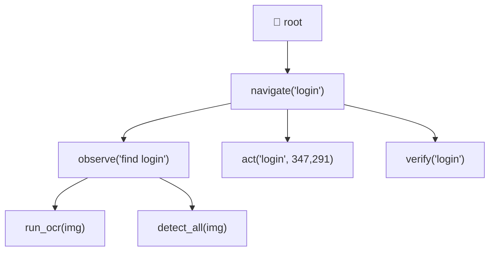
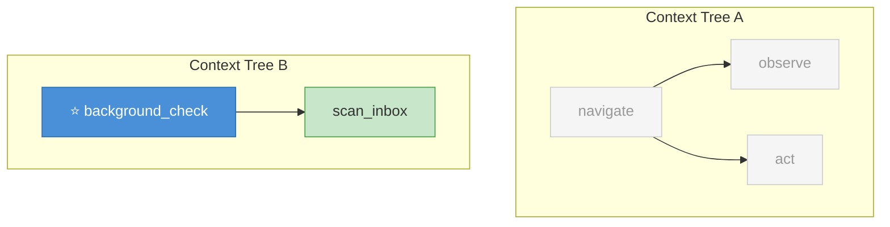
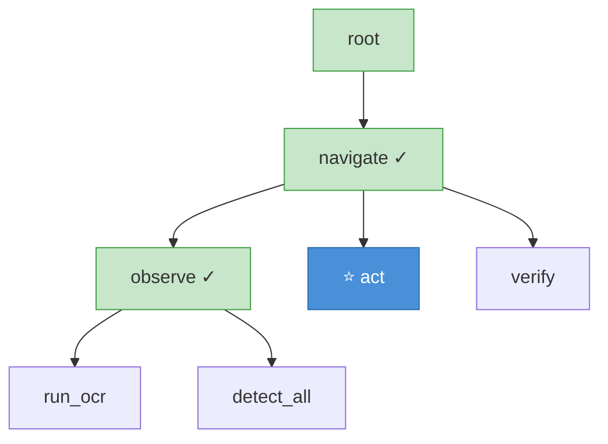
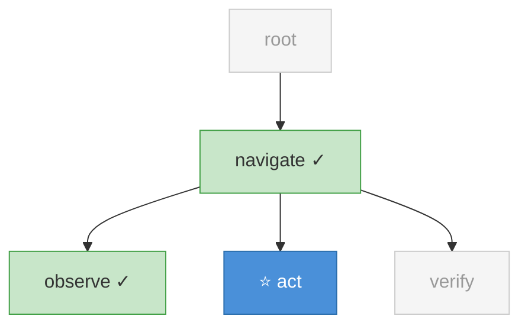
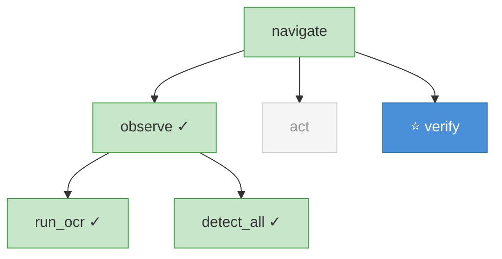

# Context Engineering

> Detailed specification for the Context system — tree structure, querying, policies, and cache optimization.

---

## 1. Overview

The Context system records all Agentic Function executions as a tree and provides flexible querying for LLM context injection.

**Core principle**: One tree records everything. `summarize()` queries selectively. Recording and querying are fully separated.

| Component | Role |
|-----------|------|
| `Context` | Dataclass. One node per function call. Forms a tree via `parent`/`children`. |
| `@agentic_function` | Decorator. Auto-creates Context nodes and manages the tree via `contextvars`. |
| `ContextPolicy` | Controls what context gets injected into LLM calls. Preset or custom. |
| `runtime.exec()` | LLM call interface. Auto-applies ContextPolicy for context injection. |

---

## 2. Context Tree Structure

Every `@agentic_function` call creates a `Context` node. Nodes form a tree:

```
root
├── navigate("login")                        ← root/navigate_0
│   ├── observe("find login")                ← root/navigate_0/observe_0
│   │   ├── run_ocr(img)                     ← root/navigate_0/observe_0/run_ocr_0
│   │   └── detect_all(img)                  ← root/navigate_0/observe_0/detect_all_0
│   ├── observe("find password")             ← root/navigate_0/observe_1
│   │   └── run_ocr(img)                     ← root/navigate_0/observe_1/run_ocr_0
│   ├── act("click login", [347, 291])       ← root/navigate_0/act_0
│   └── verify("login success")              ← root/navigate_0/verify_0
└── navigate("settings")                     ← root/navigate_1
    └── ...
```



[Mermaid source: 01-full-tree.mmd](01-full-tree.mmd)

### 2.1 Context Node Fields

Each `Context` node records:

| Field | Set by | Description |
|-------|--------|-------------|
| `name` | `@agentic_function` | Function name (`__name__`) |
| `prompt` | `@agentic_function` | Docstring (`__doc__`). In Agentic Programming, docstring = LLM prompt. |
| `params` | `@agentic_function` | Call arguments (auto-captured from `*args, **kwargs`) |
| `output` | `@agentic_function` | Return value |
| `error` | `@agentic_function` | Error message if the function raised an exception |
| `status` | `@agentic_function` | `"running"` → `"success"` or `"error"` |
| `expose` | `@agentic_function` | Rendering hint for `summarize()`. See §4. |
| `parent` | `@agentic_function` | Parent node (caller) |
| `children` | `@agentic_function` | Child nodes (sub-calls) |
| `start_time` | `@agentic_function` | Unix timestamp at function entry |
| `end_time` | `@agentic_function` | Unix timestamp at function exit |
| `input` | `runtime.exec()` | Data sent to LLM |
| `media` | `runtime.exec()` | Media file paths (screenshots, etc.) |
| `raw_reply` | `runtime.exec()` | LLM's raw response text |
| `_policy` | `@agentic_function` | ContextPolicy instance (if set). See §5. |
| `_cached_render` | `ContextPolicy` | Frozen rendering for cache stability. See §7. |

### 2.2 Path Addressing

Every node has an auto-computed `path` property. Format: `parent_path/name_index`.

The index counts same-name siblings (0-based). This enables precise addressing when a function is called multiple times:

```python
ctx.path  # → "root/navigate_0/observe_1/run_ocr_0"
```

Path is NOT stored — computed on access from `parent`/`children` relationships.

```
root/
├── navigate_0/
│   ├── observe_0          → root/navigate_0/observe_0
│   ├── observe_1          → root/navigate_0/observe_1
│   │   ├── run_ocr_0      → root/navigate_0/observe_1/run_ocr_0
│   │   └── detect_all_0   → root/navigate_0/observe_1/detect_all_0
│   ├── act_0              → root/navigate_0/act_0
│   └── verify_0           → root/navigate_0/verify_0
└── navigate_1/
    ├── observe_0          → root/navigate_1/observe_0
    └── act_0              → root/navigate_1/act_0
```

[Mermaid source: 07-path-addressing.mmd](07-path-addressing.mmd)

---

## 3. Tree Attachment Modes

The `context` parameter on `@agentic_function` controls how a node attaches to the tree:

| Mode | Behavior | Use case |
|------|----------|----------|
| `"auto"` (default) | Attach to parent if exists; create root if none | Most functions. Zero setup. |
| `"inherit"` | Must have parent; `RuntimeError` if none | Sub-functions that should never be called standalone |
| `"new"` | Always create an independent tree | Background tasks, parallel work |
| `"none"` | Skip Context tracking entirely | Pure computation, no overhead |

```python
@agentic_function                            # auto (default)
def navigate(target): ...

@agentic_function(context="inherit")         # must be called from another @agentic_function
def observe(task): ...

@agentic_function(context="new")             # independent tree
def background_check(): ...

@agentic_function(context="none")            # no tracking
def pure_compute(x): ...
```

### 3.1 Auto Root Creation

When `context="auto"` and no parent exists, the decorator creates a synthetic `root` node:

```python
@agentic_function
def main():       # No init_root() needed
    observe("x")  # main becomes child of auto-created root
```

This was added after discovering that without `init_root()`, the Context tree was silently lost after execution (Codex review v4, issue #1).

### 3.2 Independent Trees



[Mermaid source: 06-new-tree.mmd](06-new-tree.mmd)

---

## 4. Expose Levels

The `expose` parameter controls how OTHER functions see THIS function's results in `summarize()`:

| Level | Output | Token cost | When to use |
|-------|--------|------------|-------------|
| `"trace"` | Prompt + full I/O + raw LLM reply + error | Highest | Debugging, error investigation |
| `"detail"` | `name(params) → status \| input \| output` | High | Planning functions that need full context |
| `"summary"` (default) | `name: output_snippet duration` | Medium | Most functions |
| `"result"` | Just the return value (JSON) | Low | Orchestrators that only need outcomes |
| `"silent"` | Not shown at all | Zero | Internal helpers, infrastructure |

```python
@agentic_function(expose="detail")     # Others see full I/O
def observe(task): ...

@agentic_function(expose="result")     # Others only see return value
def act(target, location): ...

@agentic_function(expose="silent")     # Invisible to siblings
def _internal_helper(): ...
```

**Important**: `expose` is a rendering HINT, not a security boundary. `summarize(level="trace")` can override any node's expose setting.

### 4.1 Rendering Examples

Given `observe(task="find login")` that returned `{"found": True, "location": [347, 291]}`:

**trace**:
```
observe(task="find login") → success (1200ms)
  prompt: Look at the screen and describe what you see.
  input: {"task": "find login"}
  media: ["/tmp/screenshot_001.png"]
  raw_reply: I can see a login button at coordinates...
  output: {"found": true, "location": [347, 291]}
```

**detail**:
```
observe(task="find login") → success 1200ms | input: {"task": "find login"} | output: {"found": true, "location": [347, 291]}
```

**summary**:
```
observe: {"found": true, "location": [347, 291]} 1200ms
```

**result**:
```
{"found": true, "location": [347, 291]}
```

---

## 5. ContextPolicy

ContextPolicy controls what context gets injected into a function's LLM calls. It answers three questions:

1. **How many ancestors to show?** (depth)
2. **How many siblings to show?** (siblings, decay)
3. **At what detail level?** (level, progressive_detail)

### 5.1 Configuration

```python
from agentic import ContextPolicy

policy = ContextPolicy(
    # --- Ancestor visibility ---
    depth=-1,                    # -1=all, 0=none, 1=parent only, N=N levels up

    # --- Sibling visibility ---
    siblings=-1,                 # -1=all, 0=none, N=last N siblings

    # --- Detail level ---
    level="summary",             # Default render level for siblings
    
    # --- Recency decay ---
    decay=False,                 # Enable automatic decay based on sibling count
    decay_thresholds=[           # (max_n_siblings, window, level)
        (5,  -1, "detail"),      # <5 siblings: show all at detail
        (15,  3, "summary"),     # 5-14 siblings: last 3 at summary
    ],
    decay_fallback_window=1,     # >=15 siblings: last 1 only
    decay_fallback_level="result",
    
    # --- Progressive detail ---
    progressive_detail=None,     # [(recency, level), ...]
    # Example: [(1, "detail"), (3, "summary")]
    #   Most recent sibling → detail
    #   2nd-3rd most recent → summary
    #   Older → default level
    
    # --- Cache optimization ---
    cache_stable=True,           # Freeze sibling renderings for prompt cache prefix
    
    # --- Path filtering ---
    include=None,                # Path whitelist (supports * wildcard)
    exclude=None,                # Path blacklist
    branch=None,                 # Show entire subtree of named nodes
    
    # --- Token budget ---
    max_tokens=None,             # Hard budget, drops oldest first
)
```

### 5.2 Attaching to Functions

```python
@agentic_function(context_policy=policy)
def my_function(): ...
```

When `runtime.exec()` is called inside `my_function`, it automatically uses `policy.apply(ctx)` instead of the default `ctx.summarize()`.

Priority chain for context injection in `runtime.exec()`:

```
1. Explicit context= parameter     → use as-is
2. ctx._policy (from decorator)    → policy.apply(ctx)
3. No policy                       → ctx.summarize() (all ancestors + all siblings)
```

### 5.3 Preset Policies

Five built-in presets cover common patterns:

| Preset | depth | siblings | level | decay | Use case |
|--------|-------|----------|-------|-------|----------|
| `ORCHESTRATOR` | 0 | all | `"result"` | No | Top-level loops. Sees all results, no details. |
| `PLANNER` | 1 | 5 | `"summary"` | No | Decision-making. Recent history + progressive detail. |
| `WORKER` | 1 | (decay) | (decay) | **Yes** | Repeated calls (observe/act). Auto-reduces context. |
| `LEAF` | 0 | 0 | `"result"` | No | Pure computation (OCR, detection). Zero overhead. |
| `FOCUSED` | 1 | 1 | `"detail"` | No | Only needs the previous sibling's result. |

```python
from agentic import ORCHESTRATOR, PLANNER, WORKER, LEAF, FOCUSED

@agentic_function(context_policy=ORCHESTRATOR)
def navigate(target):
    """Top-level navigation loop."""
    ...

@agentic_function(context="inherit", context_policy=WORKER)
def observe(task):
    """Called 20+ times in a loop. Context auto-decays."""
    ...

@agentic_function(context="inherit", context_policy=LEAF)
def run_ocr(img):
    """Pure computation. No context needed."""
    ...
```

### 5.4 Custom Policies

```python
# Policy for a function that only cares about observe results, not act results
observe_only = ContextPolicy(
    depth=1,
    siblings=-1,
    include=["*/observe_*"],    # Only include observe siblings
    level="detail",
)

# Policy with aggressive token budget
budget_policy = ContextPolicy(
    depth=1,
    siblings=5,
    max_tokens=500,             # ~500 tokens max
    level="result",
)

# Policy combining decay + progressive detail
adaptive_policy = ContextPolicy(
    depth=1,
    decay=True,
    decay_thresholds=[
        (3,  -1, "detail"),
        (10,  5, "summary"),
        (30,  3, "result"),
    ],
    decay_fallback_window=1,
    decay_fallback_level="result",
    progressive_detail=[
        (1, "detail"),           # Most recent: full detail
        (3, "summary"),          # 2nd-3rd: summary
    ],
    cache_stable=True,
)
```

---

## 6. summarize() — Direct Tree Query

For cases where ContextPolicy doesn't fit, call `summarize()` directly:

```python
ctx.summarize(
    depth=-1,                    # Ancestor depth (-1=all, 0=none)
    siblings=-1,                 # Sibling count (-1=all, 0=none)
    level=None,                  # Override all nodes' expose levels
    max_tokens=None,             # Token budget
    max_siblings=None,           # Legacy alias for siblings=N
    include=None,                # Path whitelist (supports * wildcard)
    exclude=None,                # Path blacklist
    branch=None,                 # Show subtree of named nodes
)
```

### 6.1 Visibility Scenarios

#### Full tree (default)

```python
ctx.summarize()  # All ancestors + all siblings
```



#### Depth control

```python
ctx.summarize(depth=1)    # Only parent
ctx.summarize(depth=0)    # No ancestors
ctx.summarize(depth=2)    # Parent + grandparent
```



[Mermaid source: 02-depth-1.mmd](02-depth-1.mmd)

#### Include/exclude paths

```python
# Only show specific nodes (path whitelist)
ctx.summarize(include=["root/navigate_0/observe_1"])

# Hide specific nodes (path blacklist)
ctx.summarize(exclude=["root/navigate_0/observe_0"])

# Wildcard support
ctx.summarize(include=["root/navigate_0/observe_*"])  # All observes
ctx.summarize(include=["root/navigate_0/*"])           # Everything under navigate_0
```

[Mermaid source: 03-include-specific.mmd](03-include-specific.mmd)

#### Branch selection

```python
# Show observe + all its children (run_ocr, detect_all)
ctx.summarize(branch=["observe"])
```



[Mermaid source: 04-branch-select.mmd](04-branch-select.mmd)

#### Isolated (no context)

```python
ctx.summarize(depth=0, siblings=0)  # Empty string
```

[Mermaid source: 05-isolated.mmd](05-isolated.mmd)

### 6.2 Combining Parameters

Parameters compose naturally:

```python
# Parent only + last 3 siblings + token budget
ctx.summarize(depth=1, siblings=3, max_tokens=1000)

# All ancestors + only observe siblings + their children
ctx.summarize(include=["*/observe_*"], branch=["observe"])

# Everything except silent nodes, at trace level (for debugging)
ctx.summarize(level="trace")
```

---

## 7. Cache Stability

Prompt caching (Anthropic, OpenAI) is prefix-based: identical message prefixes hit cache at 10x cheaper rate. This requires sibling renderings to be **immutable**.

### 7.1 The Problem

Without cache stability:
```
Call  9: [..., observe_5="detail rendering", ...]     ← cached prefix
Call 10: [..., observe_5="summary rendering", ...]    ← observe_5 CHANGED → cache broken!
```

If decay changes a sibling's render level between calls, the prefix changes, invalidating the cache.

### 7.2 The Solution: `_cached_render`

When `cache_stable=True` (default in all presets except LEAF):

1. First time a sibling is rendered → store in `_cached_render`
2. Subsequent calls → use `_cached_render` regardless of current policy level
3. The rendering NEVER changes once set

```python
# In ContextPolicy.apply():
if self.cache_stable and sibling._cached_render is not None:
    rendered = sibling._cached_render          # Frozen — cache preserved
else:
    rendered = sibling._render(render_level)
    if self.cache_stable:
        sibling._cached_render = rendered      # Freeze for future calls
```

### 7.3 Interaction with Decay

Decay controls WHETHER to include a sibling, not HOW it renders:

```
Call  5: [obs_3=detail, obs_4=detail]           ← all at detail (n<5)
Call  6: [obs_3=detail, obs_4=detail, obs_5=summary]  ← obs_3,4 frozen as detail ✓
Call 15: [obs_14=result]                        ← obs_3-13 dropped entirely
```

The key: a sibling is either SHOWN (with its frozen rendering) or DROPPED (not shown at all). It never changes its text.

### 7.4 Cost Impact

With Anthropic Claude Opus 4.6 pricing:

| Token type | Price / MTok |
|------------|-------------|
| Base input | $5.00 |
| Cache hit | $0.50 |
| **Savings** | **10x** |

For a 20-step loop with ~1000 tokens of context per call:

| Strategy | Total input cost |
|----------|-----------------|
| No cache awareness (re-render each call) | ~$1.05 |
| Cache-stable rendering | ~$0.22 |

---

## 8. Tree Operations

### 8.1 Visualization

```python
root = get_root_context()

# Human-readable tree
print(root.tree())
# root …
#   navigate ✓ 3200ms → {'success': True}
#     observe ✓ 1200ms → {'found': True}
#       run_ocr ✓ 50ms → {'texts': ['Login']}
#     act ✓ 820ms → {'clicked': True}

# Error traceback
print(root.traceback())
# Agentic Traceback:
#   navigate(target="login") → error, 4523ms
#     observe(task="find login") → success, 1200ms
#     act(target="login") → error, 820ms
#       error: element not interactable
```

### 8.2 Persistence

```python
# Save as human-readable markdown
root.save("execution.md")

# Save as machine-readable JSONL (one record per node)
root.save("execution.jsonl")
```

JSONL format (one line per node):
```json
{"depth": 0, "path": "root", "name": "root", "status": "running", ...}
{"depth": 1, "path": "root/navigate_0", "name": "navigate", "params": {"target": "login"}, ...}
{"depth": 2, "path": "root/navigate_0/observe_0", "name": "observe", ...}
```

### 8.3 Programmatic Access

```python
from agentic import get_context, get_root_context, init_root

# Inside an @agentic_function:
ctx = get_context()           # Current node
ctx.parent                    # Caller
ctx.children                  # Sub-calls
ctx.path                      # "root/navigate_0/observe_1"
ctx.duration_ms               # Execution time
ctx.status                    # "running" / "success" / "error"

# From anywhere:
root = get_root_context()     # Walk up to root

# Manual root creation (rarely needed):
root = init_root("my_run")
```

---

## 9. Complete Example

```python
from agentic import agentic_function, runtime, get_root_context
from agentic import ORCHESTRATOR, WORKER, FOCUSED, LEAF

@agentic_function(context_policy=ORCHESTRATOR)
def navigate(target):
    """Navigate to a target UI element."""
    for step in range(20):
        obs = observe(task=f"find {target}")
        if obs.get("found"):
            result = act(target=target, location=obs["location"])
            if verify(target):
                return {"success": True, "steps": step}
    return {"success": False, "steps": 20}

@agentic_function(context="inherit", expose="summary", context_policy=WORKER)
def observe(task):
    """Look at the screen and describe what you see."""
    img = take_screenshot()
    return runtime.exec(
        prompt=observe.__doc__,
        input={"task": task},
        images=[img],
        call=my_llm_provider,
    )

@agentic_function(context="inherit", expose="result", context_policy=FOCUSED)
def act(target, location):
    """Click the target element."""
    click(location)
    return {"clicked": True, "target": target, "location": location}

@agentic_function(context="inherit", expose="result", context_policy=LEAF)
def verify(target):
    """Check if the action succeeded."""
    img = take_screenshot()
    return runtime.exec(
        prompt=verify.__doc__,
        input={"target": target},
        images=[img],
        call=my_llm_provider,
    )

# Run
navigate("login")

# Inspect
root = get_root_context()
print(root.tree())
root.save("navigation_log.jsonl")
```

What each function sees at step 15:

| Function | Policy | Sees |
|----------|--------|------|
| `navigate` | ORCHESTRATOR | All 30+ children's return values (result level) |
| `observe` (step 15) | WORKER (decay) | Parent goal + last 1-3 siblings (auto-decayed) |
| `act` | FOCUSED | Parent goal + observe's result only |
| `verify` | LEAF | Nothing — just its own prompt and input |

---

## 10. Design History

| Version | Change | Reason |
|---------|--------|--------|
| v1 | `sibling_summaries()` — fixed format, immediate siblings only | Too rigid for complex trees |
| v2 | Renamed to `summarize()`, added parent info | Better but still one-size-fits-all |
| v3 | Added depth, siblings, include/exclude/branch, ContextPolicy | Full flexibility needed for real tasks |

Key lessons:
- Users tried to pass `ctx` manually → error-prone. Now fully automatic via `contextvars`.
- Fixed context window → wasteful at scale. Recency decay solved it.
- Changing sibling renderings between calls → broke prompt cache. Cache stability solved it.
- One policy for all functions → impossible. Per-function ContextPolicy solved it.
